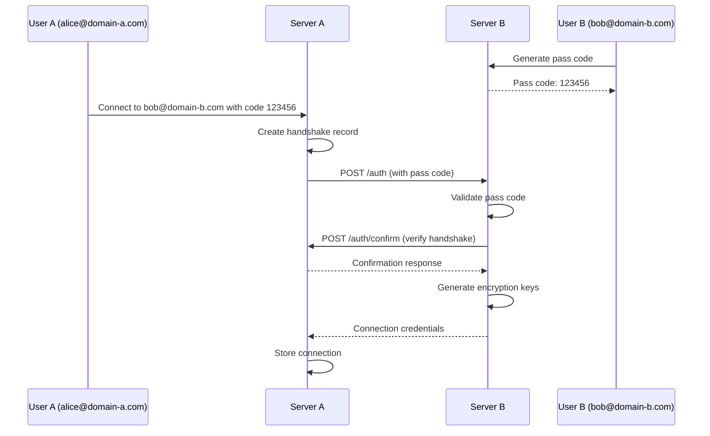
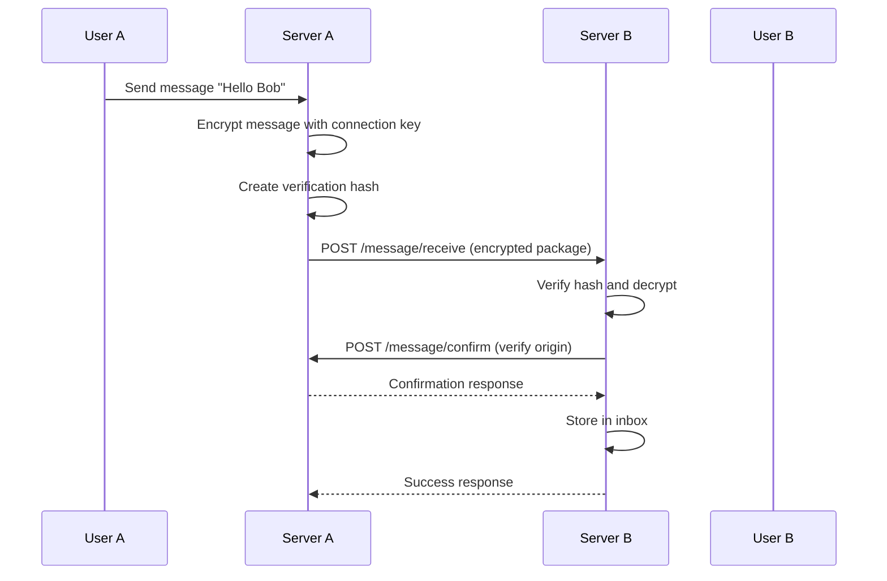

# CleanSend - OpenMsg Protocol Server

[](https://badge.fury.io/js/cleansend)
[](https://opensource.org/licenses/ISC)
[](http://www.typescriptlang.org/)

CleanSend is a TypeScript implementation of the **OpenMsg Protocol**, a secure, decentralized messaging system that enables encrypted communication between users across different domains and servers. This package is published on npm and ready for production deployment.

## 📦 Installation

### Via npm (Recommended)

```bash
# Install the published package
npm install cleansend

# Or install globally
npm install -g cleansend
```

### From Source

```bash
# Clone the repository
git clone https://github.com/Keshara1997/CleanSend.git
cd CleanSend

# Install dependencies
npm install
# Build the project
npm run build
# Start the server
npm start
# Or for development with auto-reload
npm run dev
```

## 🔐 Features

- **End-to-End Encryption**: AES-256-GCM authenticated encryption with unique keys per connection
- **Cross-Domain Messaging**: Secure communication between users on different OpenMsg servers
- **Handshake Protocol**: Pass code-based authentication for connection establishment
- **Message Verification**: SHA-256 hash verification with replay attack prevention
- **Sandbox Mode**: Development and testing environment support
- **Database-Driven**: MySQL backend with connection pooling
- **Type Safety**: Full TypeScript implementation with comprehensive type definitions
- **Security Headers**: Helmet.js integration for enhanced security
- **API Monitoring**: Health check endpoints and request logging
- **Production Ready**: Published npm package with proper versioning

## 📚 NPM Dependencies

### Core Dependencies

- **[express](https://www.npmjs.com/package/express)** `^4.21.2` - Fast, unopinionated web framework for Node.js
- **[mysql2](https://www.npmjs.com/package/mysql2)** `^3.6.5` - MySQL client with prepared statements and connection pooling
- **[bcrypt](https://www.npmjs.com/package/bcrypt)** `^5.1.1` - Password hashing with adaptive salt rounds
- **[axios](https://www.npmjs.com/package/axios)** `^1.6.2` - HTTP client for server-to-server communication
- **[helmet](https://www.npmjs.com/package/helmet)** `^7.1.0` - Security middleware with various HTTP headers
- **[cors](https://www.npmjs.com/package/cors)** `^2.8.5` - Cross-Origin Resource Sharing middleware
- **[dotenv](https://www.npmjs.com/package/dotenv)** `^16.3.1` - Environment variable management

### Development Dependencies

- **[typescript](https://www.npmjs.com/package/typescript)** `^5.3.2` - TypeScript compiler and language support
- **[ts-node-dev](https://www.npmjs.com/package/ts-node-dev)** `^2.0.0` - Development server with hot reload
- **[ts-node](https://www.npmjs.com/package/ts-node)** `^10.9.1` - TypeScript execution environment
- **[@types/\*](https://www.npmjs.com/search?q=%40types)** - TypeScript type definitions for all dependencies
- **[rimraf](https://www.npmjs.com/package/rimraf)** `^5.0.5` - Cross-platform rm -rf utility

## 🏗️ Architecture

```
┌─────────────────┐    HTTPS/REST     ┌─────────────────┐
│   OpenMsg       │ ←─────────────→   │   OpenMsg       │
│   Server A      │                   │   Server B      │
│   (CleanSend)   │                   │   (CleanSend)   │
└─────────────────┘                   └─────────────────┘
        │                                       │
        ▼                                       ▼
┌─────────────────┐                   ┌─────────────────┐
│   MySQL         │                   │   MySQL         │
│   Database      │                   │   Database      │
└─────────────────┘                   └─────────────────┘
```

## 🚀 Quick Start

### Prerequisites

- **Node.js** 18+
- **MySQL** 8.0+
- **npm** or **yarn**

### Using the Published Package

1. **Install CleanSend**

   ```bash
   npm install cleansend
   ```

2. **Create configuration file**

   ```bash
   # Create .env file in your project root
   touch .env
   ```

3. **Configure environment variables**

   ```env
   # Server Configuration
   OPENMSG_DOMAIN=your-domain.com
   PORT=3000
   NODE_ENV=development
   SANDBOX=true

   # Database Configuration
   DB_HOST=localhost
   DB_USER=openmsg_user
   DB_PASSWORD=your_password
   DB_NAME=openmsg_db
   ```

4. **Initialize and start**

   ```bash
   # Setup database (first time only)
   npx cleansend setup

   # Start the server
   npx cleansend start

   # Or for development with auto-reload
   npx cleansend dev
   ```

### Development Setup

1. **Clone the repository**

   ```bash
   git clone https://github.com/your-username/CleanSend.git
   cd CleanSend
   ```

2. **Install dependencies**

   ```bash
   npm install
   ```

3. **Configure environment**

   ```bash
   cp .env.example .env
   # Edit .env with your configuration
   ```

4. **Environment Variables**

   ```env
   # Server Configuration
   OPENMSG_DOMAIN=your-domain.com
   PORT=3000
   NODE_ENV=development
   SANDBOX=true

   # Database Configuration
   DB_HOST=localhost
   DB_USER=openmsg_user
   DB_PASSWORD=your_password
   DB_NAME=openmsg_db
   ```

5. **Initialize Database**

   ```bash
   npm run setup
   ```

6. **Start the server**

   ```bash
   # Development mode with auto-reload
   npm run dev

   # Production mode
   npm start
   ```

## 📊 Database Schema

The OpenMsg protocol uses several database tables:

- `openmsg_users` - User accounts and credentials
- `openmsg_user_connections` - Established connections with encryption keys
- `openmsg_handshakes` - Temporary handshake records for authentication
- `openmsg_passCodes` - One-time pass codes for authorization
- `openmsg_messages_inbox` - Received messages
- `openmsg_messages_outbox` - Pending message confirmations
- `openmsg_messages_sent` - Confirmed sent messages

## 🔑 OpenMsg Protocol Flow

### 1. Connection Establishment



### 2. Message Sending



## 🛠️ API Endpoints

### Core Protocol Endpoints

- `POST /openmsg/auth` - Authentication requests
- `POST /openmsg/auth/confirm` - Authentication confirmation
- `POST /openmsg/message/receive` - Receive encrypted messages
- `POST /openmsg/message/confirm` - Confirm message authenticity
- `GET /openmsg/info` - Protocol information

### Setup & Testing Endpoints

- `POST /openmsg/setup/initiate-handshake` - Start connection with another user
- `POST /openmsg/setup/send-message` - Send message to connected user
- `POST /openmsg/setup/request-pass-code` - Generate authentication pass code

### System Endpoints

- `GET /health` - Health check and server status
- `GET /` - Basic server information

## 🔒 Security Features

### Encryption

- **AES-256-GCM** authenticated encryption for messages
- **Unique encryption keys** per user connection
- **Random nonces** for each message to prevent replay attacks

### Authentication

- **Pass code system** with 1-hour expiration
- **Cross-domain verification** to prevent spoofing
- **Connection-based authorization** for message sending

### Integrity Protection

- **SHA-256 hashing** with auth codes and timestamps
- **Message confirmation** between servers
- **Replay attack prevention** with timestamp validation

## 🧪 Testing

### Running Tests

```bash
# Type checking
npm run typecheck

# Build project
npm run build

# Start development server
npm run dev

# Clean build directory
npm run clean
```

### Manual Testing

1. **Generate a pass code**

   ```bash
   curl -X POST http://localhost:3000/openmsg/setup/request-pass-code \
     -H "Content-Type: application/json" \
     -d '{"self_openmsg_address": "1000001*your-domain.com"}'
   ```

2. **Initiate handshake**

   ```bash
   curl -X POST http://localhost:3000/openmsg/setup/initiate-handshake \
     -H "Content-Type: application/json" \
     -d '{
       "other_openmsg_address": "1000002*other-domain.com",
       "pass_code": "123456"
     }'
   ```

3. **Send message**
   ```bash
   curl -X POST http://localhost:3000/openmsg/setup/send-message \
     -H "Content-Type: application/json" \
     -d '{
       "message_text": "Hello OpenMsg!",
       "sending_openmsg_address": "1000001*your-domain.com",
       "receiving_openmsg_address": "1000002*other-domain.com"
     }'
   ```

## 📁 Project Structure

```
CleanSend/
├── src/
│   ├── config/          # Configuration files
│   │   ├── database.ts  # Database connection and pooling
│   │   └── settings.ts  # Environment variable handling
│   ├── setup/           # Route handlers
│   │   ├── auth.ts      # Authentication endpoints
│   │   ├── messages.ts  # Message handling endpoints
│   │   └── setup.ts     # Testing and admin endpoints
│   ├── type/            # TypeScript type definitions
│   │   └── index.ts     # All protocol interfaces and types
│   ├── utils/           # Utility functions
│   │   └── crypto.ts    # Cryptographic functions
│   └── server.ts        # Main application entry point
├── package.json         # Dependencies and scripts
├── tsconfig.json        # TypeScript configuration
├── LICENSE              # ISC License
└── README.md           # This file
```

## 📦 Package Information

- **Package Name**: `cleansend`
- **Version**: `1.0.1`
- **Author**: Keshara1997
- **License**: ISC
- **Repository**: [GitHub](https://github.com/Keshara1997/CleanSend)
- **Keywords**: cleansend, messaging, secure, protocol, typescript

### Available Scripts

```bash
npm run build      # Compile TypeScript to JavaScript
npm run start      # Build and start production server
npm run dev        # Start development server with hot reload
npm run setup      # Initialize database and setup
npm run watch      # Watch for changes and rebuild
npm run clean      # Remove build directory
npm run typecheck  # Run TypeScript type checking
```

## 🌐 Production Deployment

### Using the npm package

```bash
# Install globally for system-wide use
npm install -g cleansend

# Or locally in your project
npm install cleansend

# Set production environment
export NODE_ENV=production
export SANDBOX=false

# Start production server
cleansend start
```

### Environment Setup

```env
NODE_ENV=production
SANDBOX=false
OPENMSG_DOMAIN=your-production-domain.com
PORT=443
DB_HOST=your-db-host
DB_USER=production_user
DB_PASSWORD=secure_password
```

### SSL Configuration

The OpenMsg protocol requires HTTPS for security. Configure your reverse proxy (nginx, Apache) or use a service like Cloudflare.

### Database Optimization

- Enable MySQL query caching
- Configure appropriate connection pool sizes
- Regular database maintenance and monitoring

## 🤝 Contributing

1. Fork the repository
2. Create a feature branch (`git checkout -b feature/amazing-feature`)
3. Commit your changes (`git commit -m 'Add amazing feature'`)
4. Push to the branch (`git push origin feature/amazing-feature`)
5. Open a Pull Request

### Development Guidelines

- Follow TypeScript best practices
- Maintain 100% type safety
- Add tests for new features
- Update documentation for API changes
- Use conventional commit messages

## 📄 License

This project is licensed under the ISC License - see the [LICENSE](LICENSE) file for details.

## 🔗 Related Resources

- [NPM Package](https://www.npmjs.com/package/cleansend)
- [OpenMsg Protocol Specification](https://openmsg.org)
- [TypeScript Documentation](https://www.typescriptlang.org/docs/)
- [Express.js Guide](https://expressjs.com/en/guide/)
- [MySQL 8.0 Reference](https://dev.mysql.com/doc/refman/8.0/en/)

## 📞 Support

For questions and support:

- Create an issue on [GitHub](https://github.com/Keshara1997/CleanSend/issues)
- Check the [documentation](https://github.com/Keshara1997/CleanSend#readme)
- Review the code comments for implementation details
- Visit the [npm package page](https://www.npmjs.com/package/cleansend)

---

Built with ❤️ using TypeScript, Express.js, and MySQL | Published on [npm](https://www.npmjs.com/package/cleansend)
